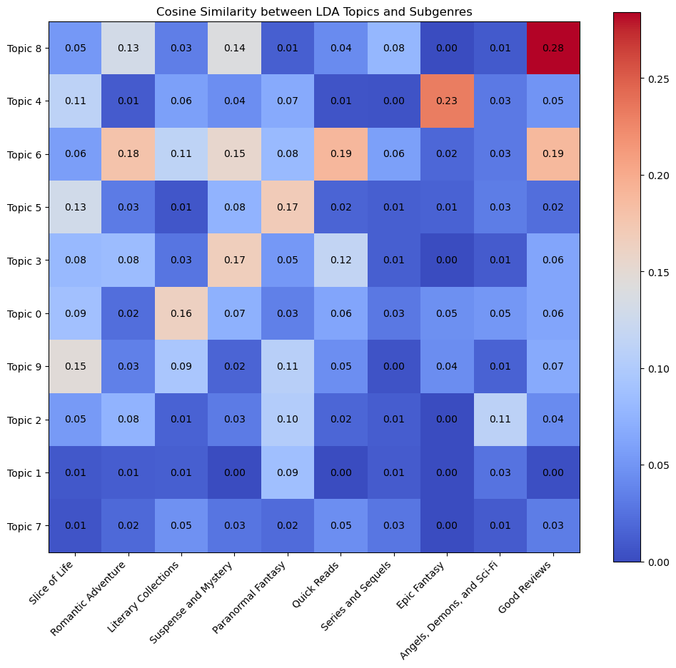
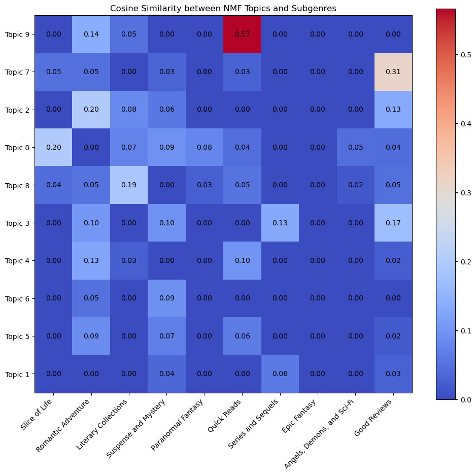
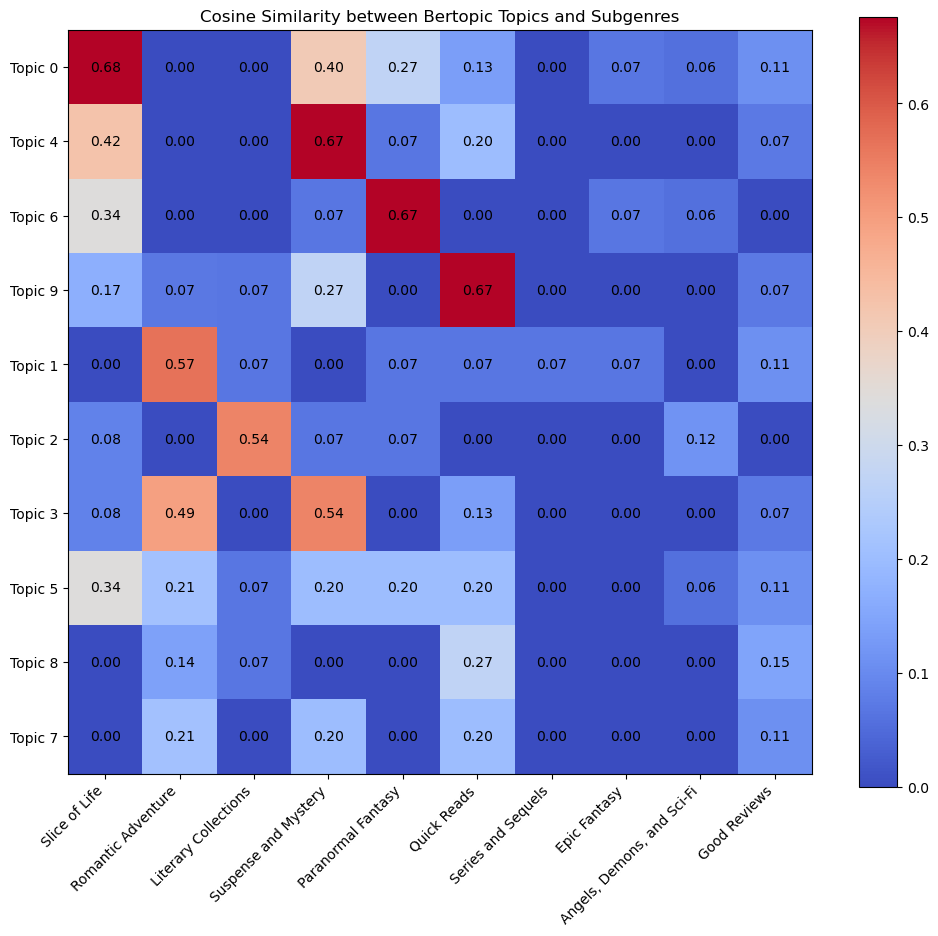

# Goodreads Fantasy Subgenre Classification

This repository contains the code and documentation for the **Subgenre Classification of Goodreads Fantasy Book Reviews** using advanced topic modeling techniques. The goal of this project is to classify Goodreads fantasy reviews into predefined subgenres, leveraging various topic modeling algorithms, including Non-Negative Matrix Factorization (NMF), Latent Dirichlet Allocation (LDA), and BERTopic.

## Table of Contents
- [Research Objective](#research-objective)
- [Dataset Description](#dataset-description)
- [Models Used](#models-used)
- [Analysis Workflow](#analysis-workflow)
- [Results](#results)
- [Visualizations](#visualizations)
- [Future Research](#future-research)

## Research Objective
The objective of this research is to accurately classify Goodreads fantasy book reviews into one of the predefined subgenres by applying advanced topic modeling techniques.

The models used include:
- Non-Negative Matrix Factorization (NMF)
- Latent Dirichlet Allocation (LDA)
- BERTopic (transformer-based embeddings and clustering)

## Dataset Description
The dataset used for this analysis consists of over **3.4 million reviews** from the **Fantasy & Paranormal** category on Goodreads. The data can be accessed and downloaded from the following link: [Goodreads Datasets](https://mengtingwan.github.io/data/goodreads.html). After cleaning and preprocessing, we worked with a subset of **2 million English-language reviews**.

## Models Used

### 1. **Non-Negative Matrix Factorization (NMF)**
NMF is a matrix factorization technique used to uncover latent topics in the dataset by decomposing term-frequency-inverse-document-frequency (TF-IDF) matrices. NMF was applied with 10 components to identify latent subgenres.

### 2. **Latent Dirichlet Allocation (LDA)**
LDA is a generative probabilistic model that assumes each document is a mixture of topics, and each topic is a mixture of words. It was applied to a dictionary and corpus built from the cleaned text data.

### 3. **BERTopic**
BERTopic uses transformer-based embeddings and clustering algorithms to uncover topics within text data. We used the **paraphrase-MiniLM-L3-v2** Sentence Transformer for embeddings and optimized the process with PCA and MiniBatchKMeans for dimensionality reduction and clustering.

## Analysis Workflow
1. **Data Preparation**: Text was preprocessed by cleaning, removing stop words, and filtering non-English reviews. Reviews were represented using the cleaned text.
2. **Modeling**: NMF, LDA, and BERTopic were applied to the cleaned text to extract topics.
3. **Subgenre Classification**: Each topic was compared to a predefined subgenre dictionary, and labels were assigned using cosine similarity.
4. **Results Interpretation**: Subgenres were validated by analyzing the top words of each topic and cross-referencing them with the predefined subgenre dictionary.

## Results
- **Top Subgenres**: The most prominent subgenres were "Slice of Life," "Suspense and Mystery," "Romantic Adventure," "Literary Collections," and "Opinions."
- **BERTopic Performance**: BERTopic demonstrated the highest accuracy in aligning topics with subgenres. An extra "final label" column was generated based on BERTopic if no consensus was reached across models.

### Top 5 Subgenres:
| Genre                | Number of Reviews |
|----------------------|-------------------|
| Slice of Life         | 1,179,579         |
| Suspense and Mystery  | 193,373           |
| Romantic Adventure    | 189,319           |
| Literary Collections  | 146,040           |
| Opinions              | 112,881           |

Number of reviews where all labels are the same: **270,069**

## Visualizations
### Cosine Similarity between LDA Topics and Subgenres

### Cosine Similarity between NMF Topics and Subgenres

### Cosine Similarity between BERTopic Topics and Subgenres

## Future Research
Potential areas for further research include expanding the dataset to include book abstracts and experimenting with other transformer models to improve the accuracy of topic and subgenre classification.
